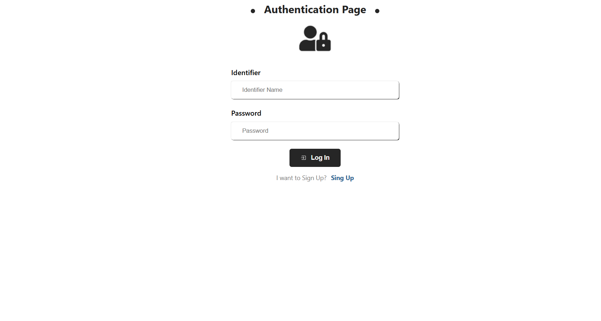
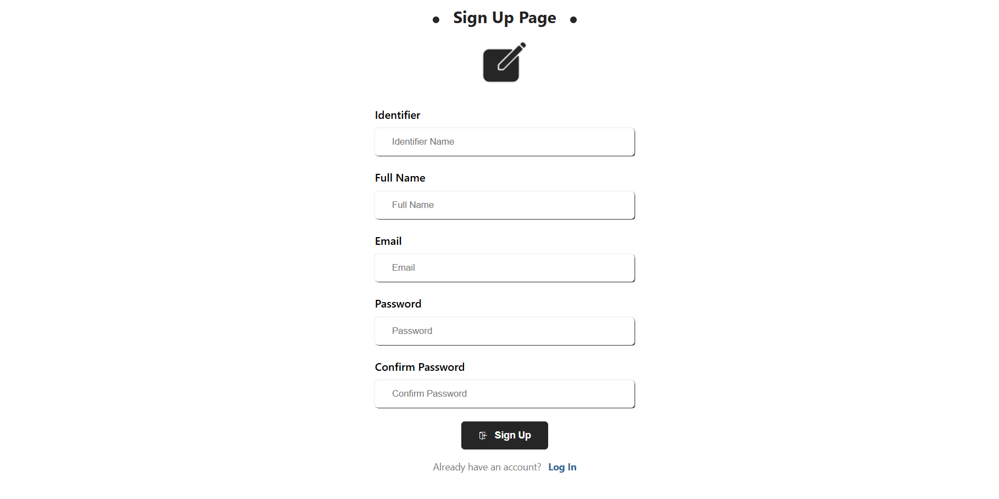
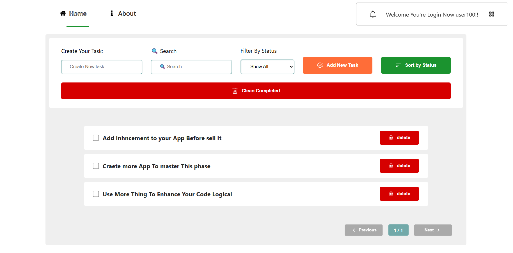
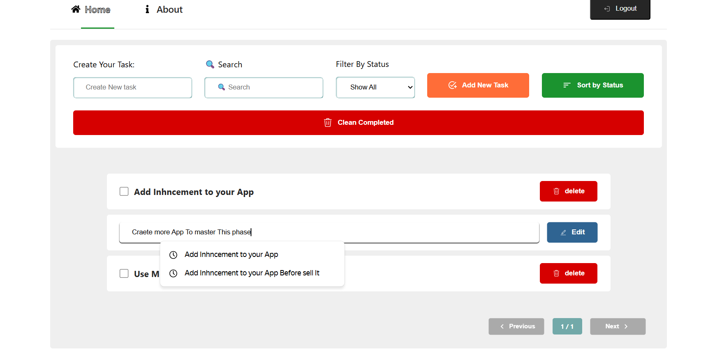
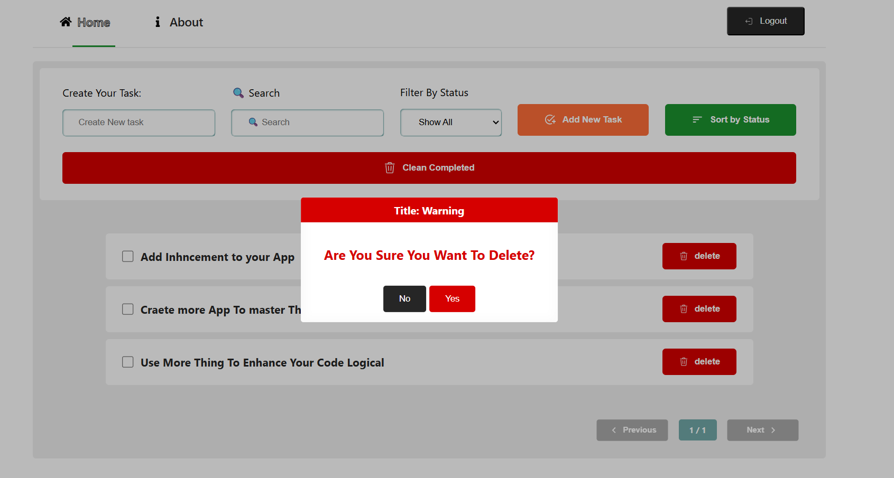
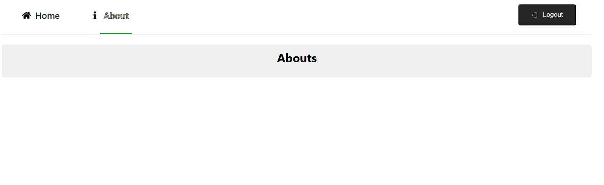

# Todo-App With React JS

a feature-rich to-do list built with React, Context API, useReducer, customs hooks, and scss Modules.
Users can Create, edit, delete, search, filter, paginate, and persist tasks in localStorage.

## Screenshots

  # Authentication

  * Login Page
  
    
  * Sign up Page
  

  # Main Pages

  * Home Page
  
  
  * home Page Editing Task
  
  
  * Home Page With Toast Box
  

  * About Page 
  

### Live Demo

try it out here: 
https://687c584e6112c142daf61e31--todo-curd-app-react.netlify.app/

code source here:
https://mounaimmoussaoui.github.io/react-todo-app/

## Features

- Add, edit, delete tasks with full CURD
- Inline editing and 'mark as done'
- Search and filter by status (all, active, complete)
- clear all completed tasks in one click
- pagination controls
- state managed via context API + useReducer
- Persistent storage with a custom 'useLocalStorage' hook
- Modular SCSS styling and responsive design
- Loader component for async feedback

## Installation & Running Locally

1. clone this repo 
  '''bash
   https://github.com/mounaimMoussaoui/react-todo-app.git
2. cd react-todo-app
3. npm install
4. npm start
5. npm run build

### Architectures || Folder Structure

- react-todo-app /
  - public/
    - index.html 
  - src/
    - Components/
      - AlertBox.jsx
      - FormUI.jsx
      - Loader.jsx
      - Pagination.jsx
      - TodoItem.jsx
    - Constants/
      All Action Needed By Fun Reducer
      - actionTypes.js
    - Contexts/
      - TodoProvider.jsx
    - CustomsHooks/
      - useLocalStorage.jsx
    - Reducers/
      - reducer.jsx
    - Style/
      - ModularStyle.module.scss
    - App.js
    - App.test.js
    - index.css
    - index.js
    - .gitignore
    - package.json
    - README.md

** Contributing
  Pull requests are welcome to propose a feature or fix:
    1. Fork the repo
    2. Create a feature branch (git checkout -b feature-name)
    3. commit your changes (git commit -m "add feature")
    4. Push to Your Branch (git push origin feature-name)
    5. open a pull request

** License

This project is Licensed under the MIT License. See LICENSE for Details

Stay in Touch
  . GitHub:  https://github.com/mounaimMoussaoui
  . Twitter: @mounaimMoussaoui

